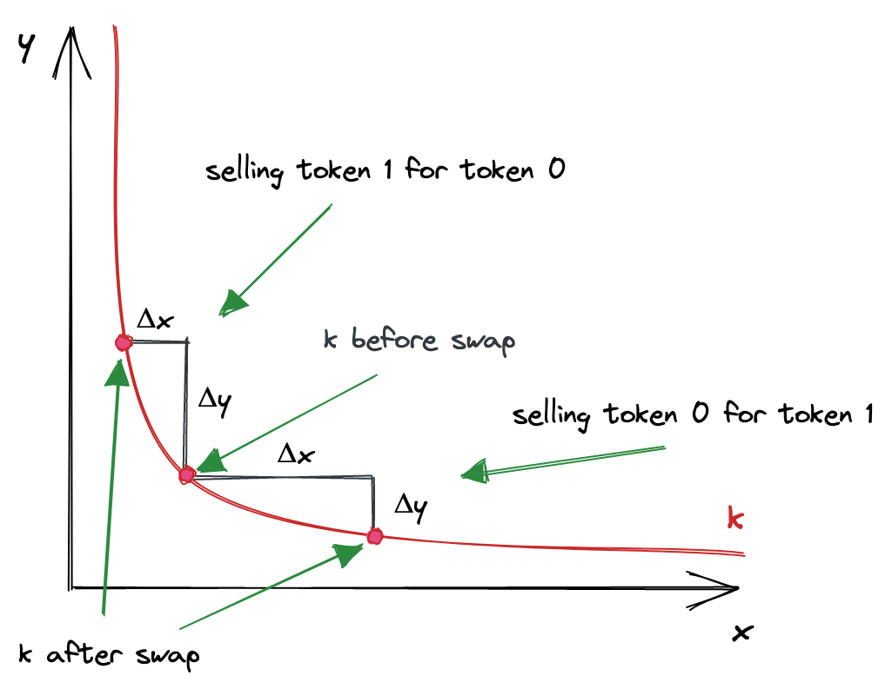
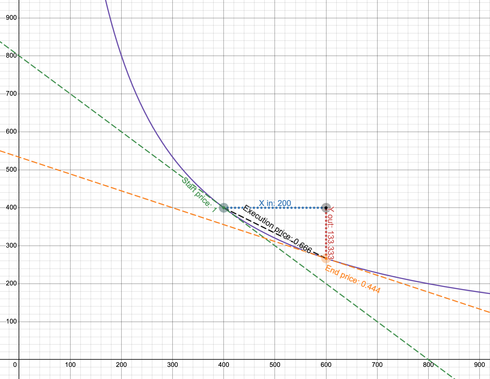

# Constant Function Market Makers

> This chapter retells [the whitepaper of Uniswap V2](https://uniswap.org/whitepaper.pdf). Understanding this math is crucial to build a Uniswap-like DEX, but it's totally fine if you don't understand everything at this stage.

As I mentioned in the previous section, there are different approaches to building AMM. We'll be focusing on and building one specific type of AMM–Constant Function Market Maker. Don't be scared by the long name! At its core is a very simple mathematical formula:

$$x * y = k$$

That's it, this is the AMM.

$x$ and $y$ are pool contract reserves–the amounts of tokens it currently holds. *k* is just their product, actual value doesn't matter.

> **Why are there only two reserves, *x* and *y*?**  
Each Uniswap pool can hold only two tokens. We use *x* and *y* to refer to reserves of one pool, where *x* is the reserve of the first token and *y* is the reserve of the other token, and the order doesn't matter.

The constant function formula says: **after each trade, *k* must remain unchanged**. When traders make trades, they put some amount of one token into a pool (the token they want to sell) and remove some amount of the other token from the pool (the token they want to buy). This changes the reserves of the pool, and the constant function formula says that **the product** of reserves must not change. As we will see many times in this book, this simple requirement is the core algorithm of how Uniswap works.

## The Trade Function
Now that we know what pools are, let's write the formula of how trading happens in a pool:

$$(x + r\Delta x)(y - \Delta y) = k$$

1. There's a pool with some amount of token 0 ($x$) and some amount of token 1 ($y$) 
1. When we buy token 1 for token 0, we give some amount of token 0 to the pool ($\Delta x$).
1. The pool gives us some amount of token 1 in exchange ($\Delta y$).
1. The pool also takes a small fee ($r = 1 - \text{swap fee}$) from the amount of token 0 we gave.
1. The reserve of token 0 changes ($x + r \Delta x$), and the reserve of token 1 changes as well ($y - \Delta y$).
1. The product of updated reserves must still equal $k$.

> We'll use token 0 and token 1 notation for the tokens because this is how they're referenced in the code. At this point, it doesn't matter which of them is 0 and which is 1.

We're basically giving a pool some amount of token 0 and getting some amount of token 1. The job of the pool is to give us a correct amount of token 1 calculated at a fair price. This leads us to the following conclusion: **pools decide what trade prices are**.

## Pricing

How do we calculate the prices of tokens in a pool?

Since Uniswap pools are separate smart contracts, **tokens in a pool are priced in terms of each other**. For example: in a ETH/USDC pool, ETH is priced in terms of USDC, and USDC is priced in terms of ETH. If 1 ETH costs 1000 USDC, then 1 USDC costs 0.001 ETH. The same is true for any other pool, whether it's a stablecoin pair or not (e.g. ETH/BTC).

In the real world, everything is priced based on [the law of supply and demand](https://www.investopedia.com/terms/l/law-of-supply-demand.asp).  This also holds true for AMMs. We'll put the demand part aside for now and focus on supply.

The prices of tokens in a pool are determined by the supply of the tokens, that is by **the amounts of reserves of the tokens** that the pool is holding. Token prices are simply relations of reserves:

$$P_x = \frac{y}{x}, \quad P_y=\frac{x}{y}$$

Where $P_x$ and $P_y$ are prices of tokens in terms of the other token.

Such prices are called *spot prices* and they only reflect current market prices. However, the actual price of a trade is calculated differently. And this is where we need to bring the demand part back.

Concluding from the law of supply and demand, **high demand increases the price**–and this is a property we need to have in a permissionless system. We want the price to be high when demand is high, and we can use pool reserves to measure the demand: the more tokens you want to remove from a pool (relative to the pool's reserves), the higher the impact of demand is.

Let's return to the trade formula and look at it closer:

$$(x + r\Delta x)(y - \Delta y) = xy$$

As you can see, we can derive $\Delta_x$ and $\Delta y$ from it, which means we can calculate the output amount of a trade based on the input amount and vice versa:

$$\Delta y = \frac{yr\Delta x}{x + r\Delta x}$$
$$\Delta x = \frac{x \Delta y}{r(y - \Delta y)}$$

In fact, these formulas free us from calculating prices! We can always find the output amount using the $\Delta y$ formula (when we want to sell a known amount of tokens) and we can always find the input amount using the $\Delta x$ formula (when we want to buy a known amount of tokens). Notice that each of these formulas is a relation of reserves ($x/y$ or $y/x$) and they also take the trade amount ($\Delta x$ in the former and $\Delta y$ in the latter) into consideration. **These are the pricing functions that respect both supply and demand**. And we don't even need to calculate the prices!

> Here's how you can derive the above formulas from the trade function:
$$(x + r\Delta x)(y - \Delta y) = xy$$
$$y - \Delta y = \frac{xy}{x + r\Delta x}$$
$$-\Delta y = \frac{xy}{x + r\Delta x} - y$$
$$-\Delta y = \frac{xy - y({x + r\Delta x})}{x + r\Delta x}$$
$$-\Delta y = \frac{xy - xy - y r \Delta x}{x + r\Delta x}$$
$$-\Delta y = \frac{- y r \Delta x}{x + r\Delta x}$$
$$\Delta y = \frac{y r \Delta x}{x + r\Delta x}$$
And:
$$(x + r\Delta x)(y - \Delta y) = xy$$
$$x + r\Delta x = \frac{xy}{y - \Delta y}$$
$$r\Delta x = \frac{xy}{y - \Delta y} - x$$
$$r\Delta x = \frac{xy - x(y - \Delta y)}{y - \Delta y}$$
$$r\Delta x = \frac{xy - xy + x \Delta y}{y - \Delta y}$$
$$r\Delta x = \frac{x \Delta y}{y - \Delta y}$$
$$\Delta x = \frac{x \Delta y}{r(y - \Delta y)}$$

## The Curve

The above calculations might seem too abstract and dry. Let's visualize the constant product function to better understand how it works.

When plotted, the constant product function is a quadratic hyperbola:

Where axes are the pool reserves. Every trade starts at the point on the curve that corresponds to the current ratio of reserves. To calculate the output amount, we need to find a new point on the curve, which has the $x$ coordinate of $x+\Delta x$, i.e. current reserve of token 0 + the amount we're selling. The change in $y$ is the amount of token 1 we'll get.

Let's look at a concrete example:

1. The purple line is the curve, and the axes are the reserves of a pool (notice that they're equal at the start price).
1. The start price is 1.
1. We're selling 200 of token 0. If we use only the start price, we expect to get 200 of token 1.
1. However, the execution price is 0.666, so we get only 133.333 of token 1!

This example is from [the Desmos chart](https://www.desmos.com/calculator/7wbvkts2jf) made by [Dan Robinson](https://twitter.com/danrobinson), one of the creators of Uniswap. To build a better intuition of how it works, try making up different scenarios and plotting them on the graph. Try different reserves, and see how the output amount changes when $\Delta x$ is small relative to $x$.

> As the legend goes, Uniswap was invented in Desmos.

I bet you're wondering why using such a curve. It might seem like it punishes you for trading big amounts. This is true, and this is a desirable property! The law of supply and demand tells us that when demand is high (and supply is constant) the price is also high. And when demand is low, the price is also lower. This is how markets work. And, magically, the constant product function implements this mechanism! Demand is defined by the amount you want to buy, and supply is the pool reserves. When you want to buy a big amount relative to pool reserves the price is higher than when you want to buy a smaller amount. Such a simple formula guarantees such a powerful mechanism!

Even though Uniswap doesn't calculate trade prices, we can still see them on the curve. Surprisingly, there are multiple prices when making a trade:

1. Before a trade, there's *a spot price*. It's equal to the relation of reserves, $\frac{y}{x}$ or $\frac{x}{y}$ depending on the direction of the trade. This price is also *the slope of the tangent line* at the starting point.
1. After a trade, there's a new spot price, at a different point on the curve. And it's the slope of the tangent line at this new point.
1. The actual price of the trade is the slope of the line connecting the two points!

**And that's the whole math of Uniswap! Phew!**

Well, this is the math of Uniswap V2, and we're studying Uniswap V3. So in the next part, we'll see how the mathematics of Uniswap V3 is different.